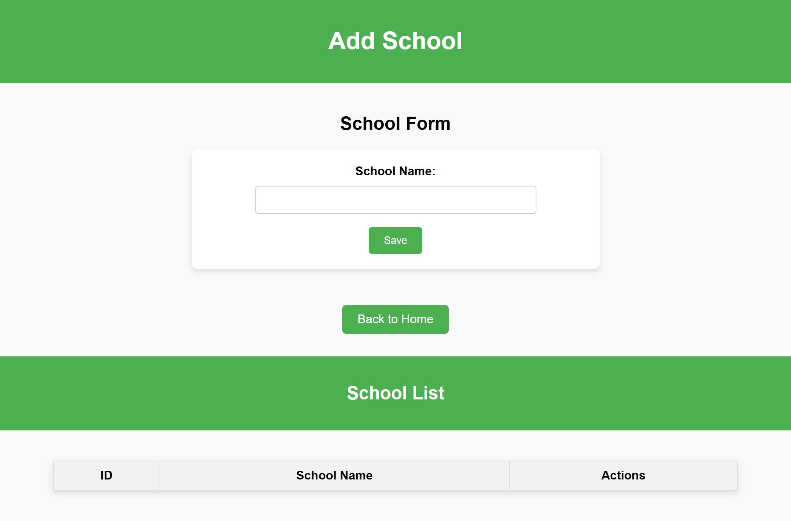
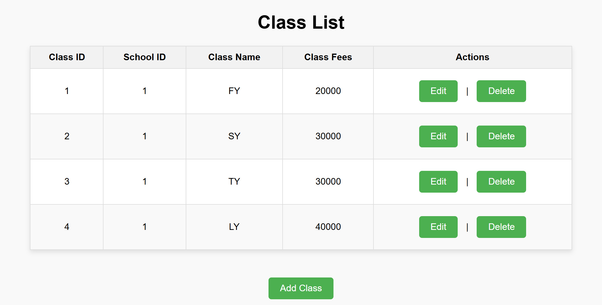

# Student Record and Activity Tracking System

## Project Description
The **Student Record and Activity Tracking System** is a web-based application designed to manage student records and monitor their activities. The system aims to streamline data storage, retrieval, and reporting for educational institutions.

## Project Features
- **Student Management**: Add, update, and delete student records.
- **Activity Tracking**: Monitor and record student activities.
- **Reporting**: Generate reports for analysis and decision-making.
- **User-Friendly Interface**: Simple and interactive web interface.

## Technologies Used
- **Frontend**: JSP, HTML, CSS, JavaScript
- **Backend**: Java Servlets
- **Database**: SQL
- **Server**: Apache Tomcat

## Setup Instructions
1. Clone the repository or download the project files.
2. Import the project into your preferred IDE (e.g., Eclipse).
3. Add the required libraries (Servlet API, JSP API) to the build path.
4. Deploy the project on an Apache Tomcat server.

## Screenshots

### Add Class

### Add School

### Add Subject

### Add Teacher

### AdmissionForm

### Attendance

### ClassList

### index

### NewSchool

### Payment

### StudentDetails

### StudentReport

### SubjectList

## Contribution
Feel free to fork this repository and contribute to its development.

